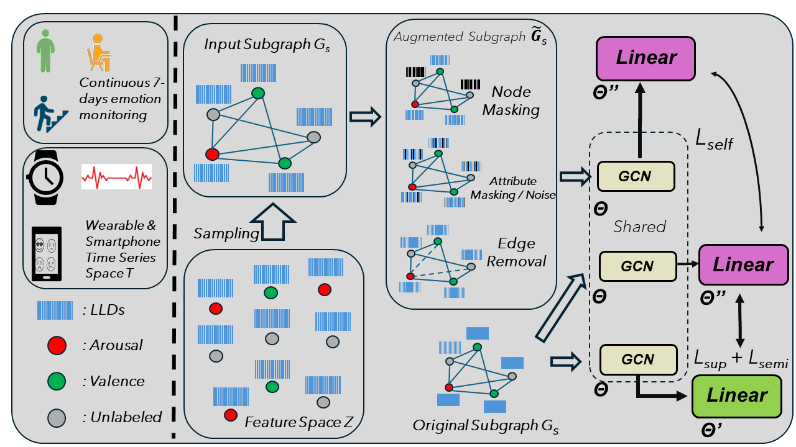

# Methodology

This document explains how the paper's methodological contribution — graph construction, graph augmentations, and the combined supervised + semi-supervised + self-supervised subgraph-sampling training scheme — is implemented in this codebase. It follows Section II of the paper (see [README.md](README.md) for the citation) and Fig. 1 below.



For a walkthrough of a single training fold, see [example_methodology.py](example_methodology.py).

## Contents
- [1. Graph construction](#1-graph-construction)
- [2. Graph augmentations (SSL pretext tasks)](#2-graph-augmentations-ssl-pretext-tasks)
- [3. Model architecture](#3-model-architecture)
- [4. Training scheme](#4-training-scheme)
- [5. Orchestration: `self_and_semi_supervised_inductive3.py`](#5-orchestration-self_and_semi_supervised_inductive3py)
- [6. Companion / ablation scripts](#6-companion--ablation-scripts)
- [7. Dependency trace](#7-dependency-trace)

## 1. Graph construction

**File:** [`construct_graph_utils.py`](construct_graph_utils.py)

Every node is a time-series segment (one ESM response), and its feature vector (after feature selection, see `training_utils._select_features`) is the node attribute. `compute_adjacency()` (lines 28–160) supports three construction methods; the one actually used by the final method is `nearest_farthest_neighbors`:

```python
# construct_graph_utils.py:58-130 (condensed)
elif method == 'nearest_farthest_neighbors':
    sim_mat = cosine_similarity(X)   # or euclidean / manhattan
    ...
    # Labeled nodes: same-label mask (using X_labels) applied before ranking neighbors
    same_label_mask = y[:, None] == y[None, :]
    sim_mat_labeled_masked[~same_label_mask] = 0
    ...
    A = np.zeros_like(sim_mat)
    for i in range(A.shape[0]):
        if i < X_labels.shape[0]:          # labeled node
            A[i, nearest_inds_labeled[i]]  = 1   # k nearest, same label
            A[i, farthest_inds_labeled[i]] = -1  # m farthest, any label
        else:                              # unlabeled node
            A[i, nearest_inds_unlabeled[i]]  = 1   # label-agnostic
            A[i, farthest_inds_unlabeled[i]] = -1
```

This builds a **signed graph**: each node gets an edge of weight **+1** to its `k` nearest same-label neighbors (label-agnostic for unlabeled nodes, since they have no label to match on) and an edge of weight **−1** to its `m` farthest neighbors, regardless of label. The final config uses `k=2` nearest, `m=1` farthest, cosine similarity (`self_and_semi_supervised_inductive3.py:157,136`). The `sup_mode='semi_sup'` branch (lines 71–130) is what activates the labeled/unlabeled split logic above.

`construct_from_np_adjacency()` (162–175) turns the numpy adjacency matrix into a `networkx` graph with node features stored as an `embedding` attribute, which is then converted to a PyTorch Geometric `Data` object via `torch_geometric.utils.from_networkx`.

**Inductive evaluation.** Because training only ever sees a small sampled subgraph, validation/test subjects are never part of it. `inductive_val()` (224–247, calling `_add_unseen_nodes()` at 203–222) attaches held-out subjects to the *already-trained* graph without touching the existing adjacency block:

```python
# construct_graph_utils.py:216-220
A_new = np.block([
    [A_old, A_temp[:A_old.shape[0], A_old.shape[0]:]],
    [A_temp[A_old.shape[0]:, :A_old.shape[0]], A_val]
])
```
`A_old` (the trained block) is preserved untouched; only the new nodes' edges (to each other and to the old graph) are computed. This is what makes the approach genuinely *inductive*.

## 2. Graph augmentations (SSL pretext tasks)

The paper defines four augmentations (Section II-B3). Each has a concrete implementation:

| Paper augmentation | Implementation | Effect |
|---|---|---|
| **Node Masking** | [`transforms.py::Completion`](transforms.py) (54–77), `masking='node'` | Zeroes out *all* features of a random subset of nodes (probability `p`) |
| **Node Attribute Masking** | `transforms.py::Completion`, `masking='feature'` | Zeroes out a random subset of *feature columns*, for every node |
| **Gaussian Noise Addition** | [`transforms.py::Denoising`](transforms.py) (16–36) | Adds `N(0,1)` noise to a random subset of feature columns |
| **Edge Removal** | external [`GCL.augmentors.EdgeRemoving`](https://github.com/PyGCL/PyGCL) (PyGCL) | Randomly drops edges with probability `pe` |

```python
# transforms.py:54-77
class Completion(nn.Module):
    def __init__(self, p=0.15, masking='feature'):
        ...
    def forward(self, data):
        ...
        if self.masking == 'feature':
            idx = torch.empty((d,)).uniform_(0, 1) < self.p
            x[:, idx] = 0            # mask feature columns for ALL nodes
        elif self.masking == 'node':
            idx = torch.empty((n,)).uniform_(0, 1) < self.p
            x[idx, :] = 0            # mask ALL features for random nodes
        return tg.data.Data(x=x, y=y, edge_index=edge_idx)
```

One augmentation can run per invocation, selected via a list (`self_and_semi_supervised_inductive3.py:198`):
```python
augmentations = ['edge_removing']  # the config that produced the paper's headline numbers
```
with per-label tuned probabilities (`:223-228`):
```python
elif augmentation == 'edge_removing':
    aug_prob = 0.05 if label == 'valence_bin' else 0.15   # arousal
    graph_aug = A.EdgeRemoving(pe=aug_prob)
```
These probabilities (and the analogous ones for the other three augmentations, lines 202–219) are the values swept in [`self_and_supervised_induct_ablate_aug_prob.py`](self_and_supervised_induct_ablate_aug_prob.py) and plotted by [`ablations.py`](ablations.py) — Fig. 2b/c in the paper.

The augmented view is built fresh from the *current epoch's sampled subgraph* (not a fixed graph) — see §4.

## 3. Model architecture

**File:** [`models.py`](models.py) → `GCN_basic_projection` (287–465)

A single shared GCN encoder `g_θ` (1–6 `GCNConv` layers, configurable width/activation/dropout/`LayerNorm`) feeds into **two separate linear heads**, selected via the `task=` argument to `forward()`:

```python
# models.py:315-319
"Projector"
self.project_semi_sup = Linear(hidden_channels, output_size)     # g_θ'  — classification head
self.project_self_sup = Linear(hidden_channels, hidden_channels) # g_θ'' — SSL projection head
```
```python
# models.py:323, 343-347 (num_layers==1 case; identical pattern for every depth)
def forward(self, input, edge_index, mode='train', task='self_sup'):
    ...
    if task == 'classif':
        x = self.project_semi_sup(x)
    elif task == 'self_sup':
        x = self.project_self_sup(x)
    return x
```
This is what lets one encoder serve both the classification objective (supervised + semi-supervised) and the SSL consistency objective — the `g_θ` / `g_θ'` / `g_θ''` split in the paper's Eq. 1. The final config uses `arch='GCN_basic_proj'`, 3 layers, hidden size 96, `tanh` activation, no `LayerNorm` (`use_lnorm=False`).

## 4. Training scheme

One model, three losses, trained on a freshly-sampled subgraph every epoch; the latest is the paper's central contribution.

### 4.1 Subgraph sampling

**Fold-level split** — `training_utils.py::cv_split()` (17–226) with `subgraph_sampling='random_both'` picks, per leave-one-subject-out fold, a fixed pool of `K_train` labeled-subject candidates from the training split (the rest of the training subjects become the unlabeled pool):
```python
# training_utils.py:179-183 (leave_one_out branch)
labeled_train_subjects = np.random.choice(train_subjects, size=K_train, replace=False)
unlabeled_train_subjects = np.setdiff1d(train_subjects, labeled_train_subjects)
```
Feature normalization (`_normalize_featurewise`, 263–297) and selection (`_select_features`, an `L1`-penalized `LinearSVC` via `SelectFromModel`, 300–342) are both fit **only on the labeled pool**, to avoid leaking unlabeled/val/test information into the feature set.

**Per-epoch resampling** — inside the training loop (`self_and_semi_supervised_inductive3.py:391-427`), a *new*, small subgraph is drawn from that pool every single epoch:
```python
# self_and_semi_supervised_inductive3.py:397-427 (overview)
Ls_groups_train = np.random.choice(labeled_train_groups_unique, size=Ls_train, replace=False)
# ... unlabeled subjects sampled without replacement until the pool is exhausted, then reshuffled
Us_groups_train = np.random.choice(available_Us_groups, size=Us_train, replace=False)

Xs_L = X_sel.iloc[Ls_train_inds]   # labeled subjects' windows
Xs_U = X_sel.iloc[Us_train_inds]   # unlabeled subjects' windows
X_train = np.vstack((Xs_L, Xs_U))  # this epoch's subgraph, from scratch
```
The final config samples `Ls_train`/`Us_train` = 11/6 subjects for arousal and 9/5 for valence (`K_train_percentage` = 0.25 / 0.2 of 47 subjects, 50/50 labeled/unlabeled split). This resampling is why a *small* graph, not one large static graph over all subjects, is built at each step — the paper's ablation (Fig. 2a, via [`semi_supervised_induct_ablate_labeled_size.py`](semi_supervised_induct_ablate_labeled_size.py)) shows this matters more than simply having more labels.

### 4.2 Combined multi-task loss

**File:** `training_utils.py::train_SSL()` (372–430) — implements Eq. 1 of the paper:

```python
# training_utils.py:389-426 (condensed)
out_classif = model(x, edge_index, mode='train', task='classif')
out_ssl_aug = model(x_aug, edge_index_aug, mode='train', task='ssl')
out_ssl_raw = model(x, edge_index, mode='train', task='ssl')

# 1) Supervised loss (Eq. 2) — cross-entropy on labeled subgraph nodes
Lce = criterion(out_classif[data.train_mask], y[data.train_mask])

# 2) Semi-supervised loss (Eq. 3) — entropy/pseudo-label regularization on unlabeled nodes
unlabeled_probs = out_classif[data.val_mask]      # val_mask here flags this epoch's
pseudolabels = unlabeled_probs.argmax(dim=1)      # *unlabeled subgraph nodes*, not a val split
Len = criterion(unlabeled_probs, pseudolabels)

# 3) Self-supervised loss (Eq. 4) — raw vs. augmented view consistency
if ssl_task in ('denoising', 'feature_masking', 'edge_removing', 'edge_perturbation'):
    Lssl = (1/num_nodes) * torch.linalg.matrix_norm(out_ssl_aug - out_ssl_raw)
elif ssl_task == 'node_masking':
    Lssl = (1/num_masked_nodes) * torch.linalg.matrix_norm(masked_embeddings_aug - masked_embeddings_raw)

loss = Lce + lambda1*Len + lambda2*Lssl
```
The final config uses `λ1=0.3`, `λ2=0.2` (`self_and_semi_supervised_inductive3.py:168,197`) — found via Bayesian hyperparameter search in [`self_and_semi_supervised_inductive3_tests_bayes_opt.py`](self_and_semi_supervised_inductive3_tests_bayes_opt.py). 

### 4.3 Inductive evaluation

After each epoch's `train_SSL()` call, held-out validation and (on new best-val-loss) test subjects are attached to the just-trained subgraph via `inductive_val()` (§1) and scored with `training_utils.test()` (433–471, precision/recall/F1 macro + per-class, confusion matrix) — **without** any further gradient updates, and without those subjects ever having participated in training:
```python
# self_and_semi_supervised_inductive3.py:519-520
data_val, _ = inductive_val(A_train, X_val, X_train, y_target, y_train_new, val_labels, ...)
valR = test(data_val.val_mask, model, data_val, criterion, device)
```

## 5. Orchestration: `self_and_semi_supervised_inductive3.py`

This script produces the paper's headline results; here all three loss terms are simultaneously active. Structure:

1. **Config** (lines 79–198): dataset/label selection, `K_train`/`Ls_train`/`Us_train` subgraph sizes, `nearest_farthest_neighbors` graph construction with `k=2`/`m=1`, model hyperparameters (`lr=0.0055`, `hidden_channels=96`, `num_layers=3`, `activation='tanh'`, `dropout=0.5`, `label_smoothing=0.1`), `λ1=0.3`/`λ2=0.2`, and the active augmentation.
2. **Fold loop** (`cv_split(..., cv_mode='leave_one_out', subgraph_sampling='random_both')`, 47 leave-one-subject-out folds): fresh `GCN_basic_projection` instance and Adam optimizer per fold.
3. **Epoch loop** (200 epochs): subgraph resampling (§4.1) → `compute_adjacency` + `construct_from_np_adjacency` (§1) → build the augmented view (§2) → `train_SSL()` (§4.2) → `inductive_val()` + `test()` on validation (§4.3) → checkpoint (`torch.save`) whenever validation loss improves, immediately followed by a test-set evaluation for that checkpoint.
4. **Post-training**: majority-vote pseudo-labels for unlabeled subjects across epochs (`scipy.stats.mode`), final inference graph, per-fold metrics dumped to `results_self_semi_sup_induct3_<timestamp>/leave_one_out_<augmentation>/eval/`.

To reproduce the valence results, change `label = 'arousal_bin'` to `'valence_bin'` at the top of the file (this also switches `K_train_percentage` and the per-augmentation probabilities via the `if label == ...` branches already in the file) and re-run.

## 6. Companion / ablation scripts

| Script | Isolates | Paper reference |
|---|---|---|
| [`semi_supervised_inductive2.py`](semi_supervised_inductive2.py) | Semi-supervised only (`Lce + λ1·Len`, no SSL term) | Table I, "pseudolabeling (semi-sup.)" row |
| [`self_and_supervised_inductive4.py`](self_and_supervised_inductive4.py) | Self-supervised + supervised, no semi-supervised term | Table I, single-augmentation rows (no pseudolabeling) |
| [`supervised_induct_with_unlabeled.py`](supervised_induct_with_unlabeled.py) / [`without_unlabeled.py`](supervised_induct_without_unlabeled.py) | Purely supervised (`λ1=λ2=0`) through the same pipeline, with/without unlabeled subjects structurally in the graph | Table I, "25%/20% labels + unlabeled" vs. fully-supervised rows |
| [`semi_supervised_induct_ablate_labeled_size.py`](semi_supervised_induct_ablate_labeled_size.py) | Sweeps `K_train ∈ {5,...,23}` | Fig. 2a |
| [`self_and_supervised_induct_ablate_aug_prob.py`](self_and_supervised_induct_ablate_aug_prob.py) | Sweeps augmentation probability `∈ {0.05,...,0.25}` for each of the 4 augmentations | Fig. 2b/c |
| `*_tests_bayes_opt.py` (both `semi_supervised_inductive2_tests_bayes_opt.py` and `self_and_semi_supervised_inductive3_tests_bayes_opt.py`) | Bayesian search over loss weights / architecture hyperparameters | Section III-C hyperparameters |

## 7. Dependency trace

```
data (K-EmoPhone) ──▶ processing_utils.py / feature_extraction.py ──▶ preproc_forGraph_v2.py
                                                                            │
                                                                    (X_sel, labeled/unlabeled subject pools)
                                                                            ▼
                                                          training_utils.cv_split(subgraph_sampling='random_both')
                                                                            │
                                          ┌─────────────────────────────────┴──────────────────────────────────┐
                                          ▼ (every epoch)                                                       │
                          construct_graph_utils.compute_adjacency(method='nearest_farthest_neighbors')          │
                                          │                                                                     │
                                          ▼                                                                     │
                          construct_graph_utils.construct_from_np_adjacency ──▶ PyG Data (raw subgraph G_s)     │
                                          │                                                                     │
                              ┌───────────┴────────────┐                                                        │
                              ▼                         ▼                                                       │
                     transforms.py /            (raw G_s, unmodified)                                          │
                     GCL.augmentors.EdgeRemoving                                                                │
                     ──▶ augmented view G̃_s            │                                                        │
                              │                         │                                                       │
                              └───────────┬─────────────┘                                                       │
                                          ▼                                                                     │
                              models.GCN_basic_projection (shared encoder, dual heads)                          │
                                          │                                                                     │
                                          ▼                                                                     │
                        training_utils.train_SSL()  =  L_sup + λ1·L_semi + λ2·L_self                            │
                                          │                                                                     │
                                          ▼                                                                     │
                        construct_graph_utils.inductive_val() ──▶ training_utils.test() ◀───────────────────────┘
                                          │
                                          ▼
                              see_results_graphs.py / ablations.py
```
